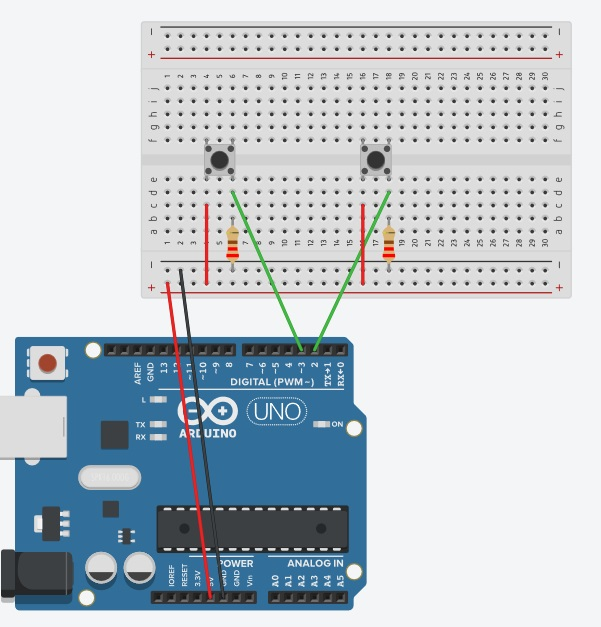
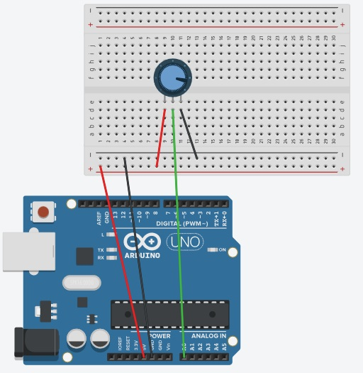
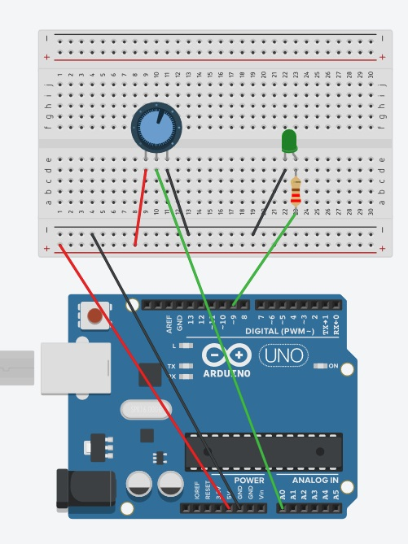

# Week 6 - Arduino: Analog and Digital Inputs and Outputs
This weeks workshop is on analog and digital input and output pins (IO) on the Arduino.

This page has the sketches for each project as well as the diagrams to set up each project.

## Homework
Continue with the Arduino project book.

Continue going through the resources from week 5.

If you can work with Node.js and serialport, go back through the week 4 videos and see if you can get the button data to the web page. Look at the set up for the two buttons today and send that data to the front end.

## References
[Slides](https://developdata.github.io/unit3_slides/week_06/#0)

### Analog
[Analog](https://www.arduino.cc/en/Tutorial/Foundations/AnalogInputPins)

### Digital
[Digital](https://www.arduino.cc/en/Tutorial/Foundations/DigitalPins)

### Pulse Width Modulation (PWM)

[PWM Example 1](https://www.arduino.cc/en/pmwiki.php?n=Tutorial/Fading)

[PWM Example 2](https://www.arduino.cc/en/Tutorial/Foundations/PWM)

[PWM Example 1](https://www.electronicshub.org/arduino-pwm)

[PWM and Analog data](https://www.programmingelectronics.com/tutorial-20-analog-io-and-serial-communications-old-version/)

## Arduino Digital Pins project
This project uses the digital pins to connect two buttons to the Arduino. For this you will need two buttons, two 220-ohm resistors and 6 jump leads. 

## Arduino Analog Pins Project
This project uses a potentiometer to demonstrate how analog pins work. With 5 volts the range of the potentiometer is from 0 to 1023. 

For this you will just need a potentiometer and 5 jump leads.

## Arduino Pulse Width Modulation (PWM) Pins
PWM pins allow you to simulate an analog signal on a digital pin. This can be used with different digital components including LED's, servo's and motors. 

In the sketch a map function is used to convert the analog range from 0 to 1023 to 0 to 255, which is the range of the duty cycle that the Leonardo and Uno can use.

For this you will need an LED, a 220-ohm resistor and 4 jump leads. 

The image below is slightly wrong, I couldn't shorten the resitor in Tinkercad when I created this images. The jump lead and resistor should be put in separate holes in the breadboard. 

## LED and Potentiometer (PWM and Analog)
While the last example used code to fade an LED up and down, you can also use components. This example shows an analog potentiometer (pot) used to fade the LED up and down.

