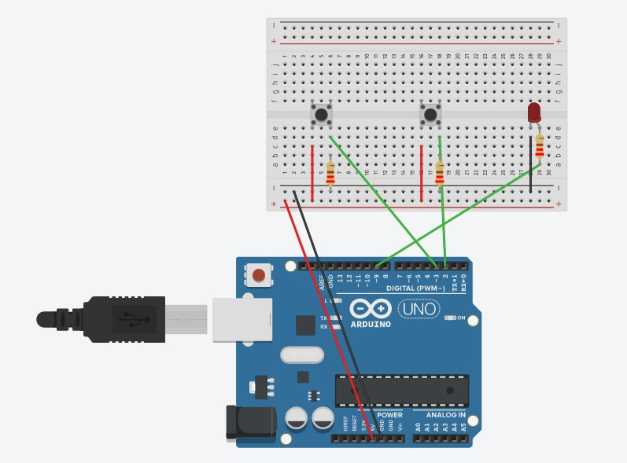

# Week 9 - Mixing Physical and Digital: Node.js and Arduino
The aim of this weeks workshop is to get comfortable using a Node.js application with an Arduino. You will be passing data between them, and visualing the data.

This will be done with a Node.js library called socket.io. socket.io has functions to let you pass data from the server to a web page, or a web page to a server as soon as that data arrives. 

This workshop will use Arduino and Node.js, with the Node.js libraries Express, serialport and socket.io.

## Homework
Create a simple Arduino set up and send data from to a Node.js application that visualises the data or uses it for an interaction. You can do this in groups. 

Once you have done this, put images of it on the shared document. Write a paragraph or two about the decisions you made and what data you connected from or to the Arduino.

## Resources
Here are some resources relating to today's videos. There are folders for each step for creating the Node.js Arduino projects from the The Structure of a Node.js project onwards.

I've included the code for the different stages I go through as well as the complete code from the video, which is in the [arduino data folder](https://github.com/developdata/CCIDiploma-Unit3/tree/master/week_9/arduino_data)

## Introduction to webSockets and socket.io
[How webSockets work](https://sookocheff.com/post/networking/how-do-websockets-work/)

## Setting up the Node.js project 
The projects this week will need a number of Node.js modules. These are Express, serialport and socket.io. In order to make sure they can be installed the first step will be initialising a Node.js application and then installing each module.

You will be using the following npm commands to set up the application.

```npm init``` to create the Node.js application

```npm i express``` to install express

```npm i serialport``` to install serialport

```npm i socket.io``` to install socket.io

Remeber to set up the .gitignore file before installing express, serialport and socket.io.

## The Structure of a Node.js project 
This section is about the files and folders you need for a Node.js application. It has the set up for the front end html, CSS and JavaScript files and how they are linked to the backend. The [code for this section is in 01_files_and_folders folder](https://github.com/developdata/CCIDiploma-Unit3/tree/master/week_9/01_files_and_folders) on this page.

## Adding the socket.io module
At the end of this section you will have the socket.io library installed and working in your application. Data will be sent from the server to the web page, which will be updated with the data. The [code for this section is on this page in the folder 02_adding_socketio](https://github.com/developdata/CCIDiploma-Unit3/tree/master/week_9/02_adding_socketio)

## Adding the serialport module
By the end of this section you will have the serialport library intergrated into your application, with the code needed to get data from the Arduino. The code for this section is on this page in the [folder 03_adding_serialport](https://github.com/developdata/CCIDiploma-Unit3/tree/master/week_9/03_adding_serialport)

## Arduino to a web page
By the end of this section, you will have set up an Arduino with two buttons, and have data from the buttons being pressed sent to the Node.js application. The data will be sent to the web page using socket.io, so the page will be updated dynamically. The node.js project code for this seciton is in the [folder 04_arduino_data](https://github.com/developdata/CCIDiploma-Unit3/tree/master/week_9/04_arduino_data). The ino file is in this folder and is called two_buttons.ino.

In this setup there are two buttons attached to an Arudino. This button data will be sent to the Node.js project which will update information on a web page. For the Arduino you will need:

- two buttons
- two 220 ohm resitors
- 6 jump leads

This is the diagram for the setup:


## Using the Arduino data with p5.js
By the end of this section you will have the buttons on the Arduino changing elements in a p5.js project. I have used the p5.js project from [week 7](https://github.com/developdata/CCIDiploma-Unit3/blob/master/week_7/p5_01.html). The Node.js code for this section is in the [folder 05_p5](https://github.com/developdata/CCIDiploma-Unit3/tree/master/week_9/05_p5).

## Sending data back to the Arduino 
By the end of this section you will have sent data from the web page, through the server, to the Arduino. This data will turn on or off an LED. You can find the Node.js code for this section in the [folder 06_p5_to_Arduino](https://github.com/developdata/CCIDiploma-Unit3/tree/master/week_9/06_p5_to_arduino), and the .ino file on at the top of this page. It is called p5_light.ino. I've also included a .ino to test that the light is working on the circut, it is called p5_test_light.ino.

You will need additional components for this, they are:

- an LED 
- 1 220 ohm resistor
- 2 jump leads

This is the diagram for the set up, it includes the two buttons you will already have set up:



## Optional Content
### the split() function
The JavaScript split function can be useful to use with data from an Arduino. In the examples there was only once piece of data coming through at a time, but you may have a string of data, for example if you were getting both temperature and hummidity data in one string. The split function allows you to split a string on say a space or a comma. It puts each element of the string into an array. [MDN has good page about the split function](https://developer.mozilla.org/en-US/docs/Web/JavaScript/Reference/Global_Objects/String/split) as does [w3schools](https://www.w3schools.com/jsref/jsref_split.asp)

### Template engines
Template engines are another way of getting data from the server onto a web page. This video is a good introduction to what they are and how they work,
[Introduction to Template Engines](https://www.youtube.com/watch?v=oZGmHNZv7Sc) and this [gives a comparison of some](https://npmcompare.com/compare/ejs,jade,pug).

### How the internet works
This is a general video on [how the internet works](http://www.youtube.com/watch?v=eiDcMY6YfEc). It talks about the architecture of the intenet and the web protocols.
